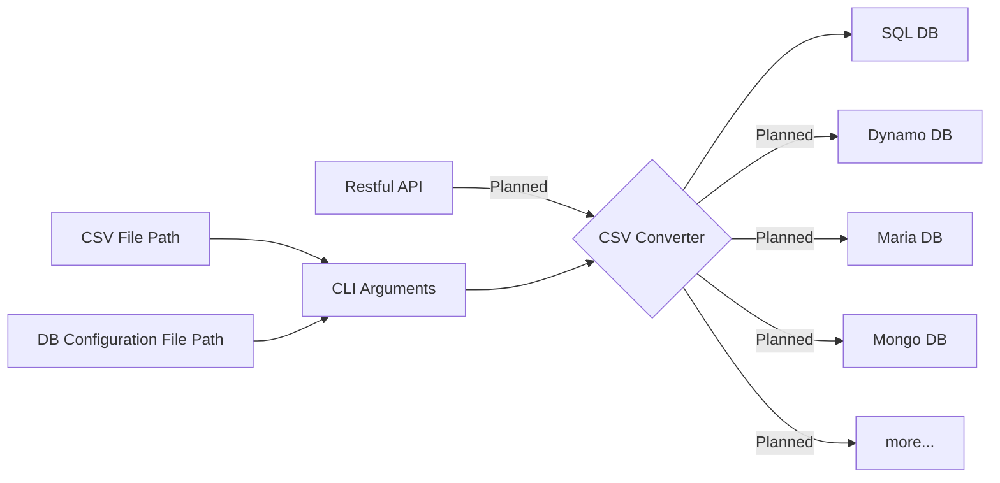

# CsvConverter Tool

The purpose of this tool is to become a swissarmy knife like tool for sending csv data to any database (SQL or No SQL) with simple command-line interface. Later phase of the project will involve developing a more user friendly GUI.

Making the CSV tool as modular as possible so it can be used as a microservice or imported as a library to enhance functionality of an existing application.

# Releases

|           	 |Feature  |Release Version| Language| 
|----------------|-----------------|--------------|-----------------------------|
|13 June, 2023|`CSV to SQL`        |CsvConverter-0.0.1-SNAPSHOT (Pre-release)            |`Java`

StackEdit stores your files in your browser, which means all your files are automatically saved locally and are accessible **offline!**

## Status Dashboard

This is a simplified diagram that showcases the functionality of the CsvConverter and future feature plans for the project.

